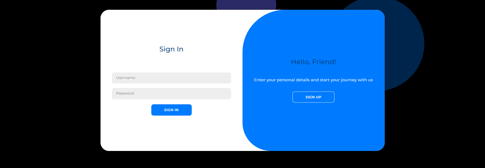
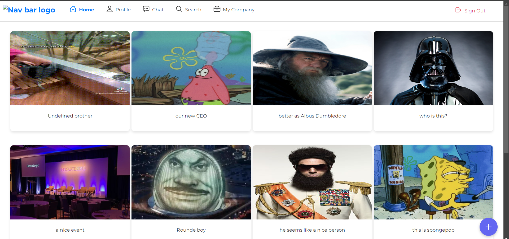
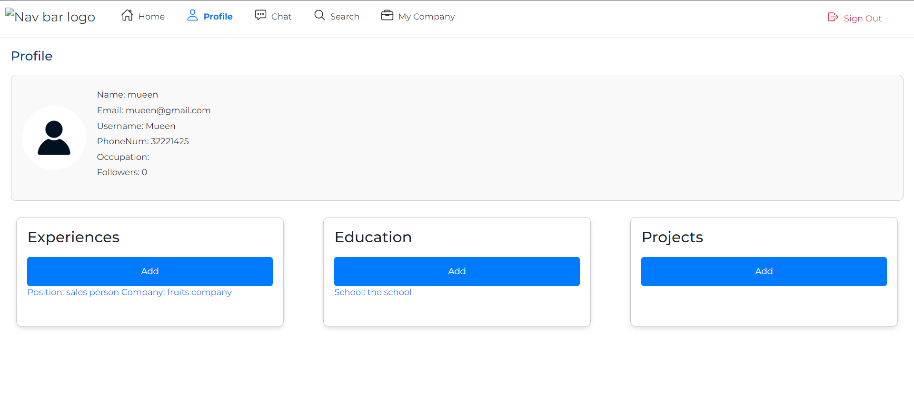
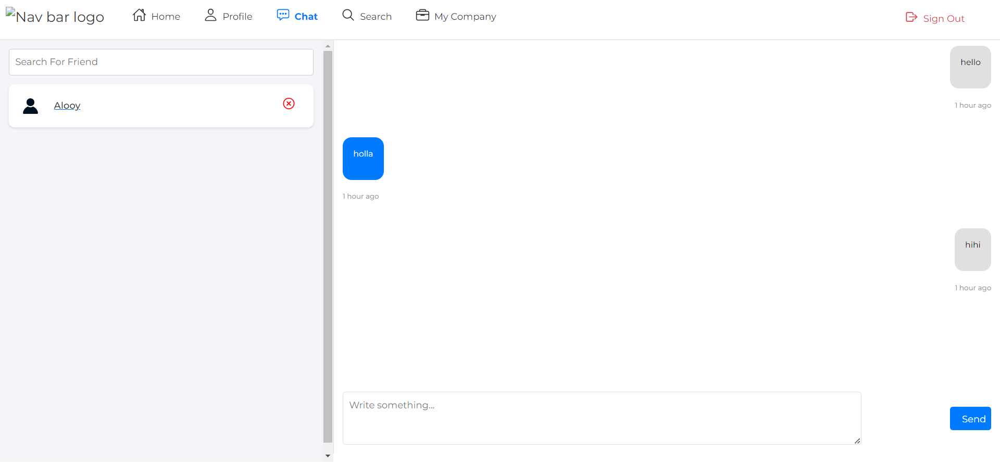
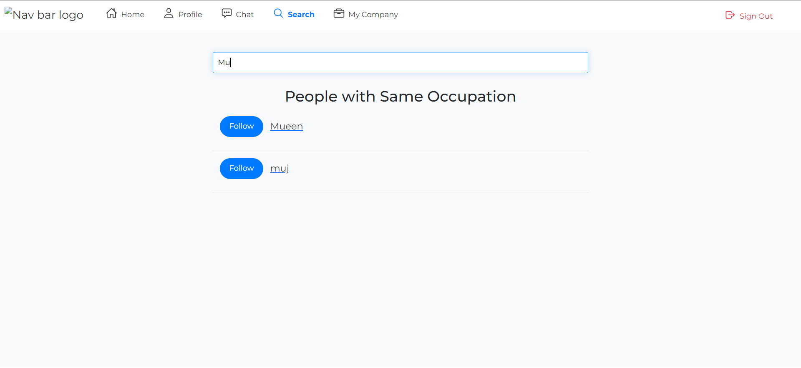

# Connectify

## by : Mueen Ali , Ali Abulkarim, Mujtaba Ali

## Getting started :

- Trello Project Planning [here](https://trello.com/b/vWEuSt6U/project4)
- a link to deployed app [here](https://connectify-front-end-six.vercel.app)
- a link to backend repository [here](https://github.com/VinsintQ/Connectify-back-end.git)

### Scope :

A website where you can chat with others and add education , project, experience to your profile and see others profile , adding posts and comment on a posts
feature to add :

- [ ] user able to apply on a jobs .

- [ ] company able to post a jobs .

- [ ] Admin to manage to website .

## user stories

- as a user i should be able to sign up and sign in to my account

- as a user i want to be able to be able to add information's about myself

- as a user i want to be able to make posts and interact on the posts

- as a user i want to be able to add and interact with people

## pictures from the app

## technologies used

- react
- javascripts
- node js
- mongoDB
- css
- express
- heroku
- vercel
- bootstrap
- socket.io

## credits 

- cloudinary for upload images
  
